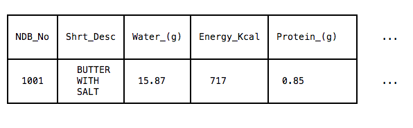
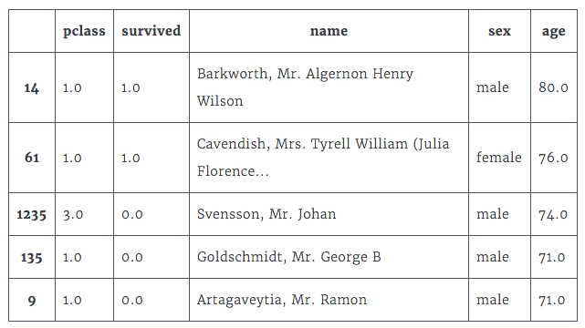

# learnDataAnalysis
This is the notebook for me to learn data science, especially for Pandas.
## 1. Getting started with Pandas

Why do I need study Pandas? Because there are some drawbacks about Numpy:

A. All of the items in an array must have the same data type. For many datasets, this can make arrays cumbersome to work with. 
B. Columns and rows must be referred to by number, which gets confusing when you go back and forth from column name to column number.

Pandas is an important tool in data scientists's toolset. Just as ndarray in Numpy, Pandas has **dataframe** to represent tabular data. 

One of the biggest advantages that pandas has over NumPy is the ability to store mixed data types in rows and columns. Many tabular datasets contain a range of data types and pandas dataframes handle mixed data types effortlessly while NumPy doesn't. Pandas dataframes can also handle missing values gracefully using a custom object, NaN, to represent those values. A common complaint with NumPy is its lack of an object to represent missing values and people end up having to find and replace these values manually. In addition, pandas dataframes contain axis labels for both rows and columns and enable you to refer to elements in the dataframe more intuitively. Since many tabular datasets contain column titles, this means that dataframes preserve the metadata from the file around the data.

### Import Pandas

Before use Pandas, we must imprt it to the python environment by typing in:

`import pandas`

### Get in CSV files

To read a CSV file into a dataframe, we use the `pandas.read_csv()` function and pass in the file name as a string:
```
# To read in the file `crime_rates.csv` into a dataframe named crime_rates.
crime_rates = pandas.read_csv("crime_rates.csv")
```
You can read more about the parameters the read_csv() method takes to customize how a file is read in on the [documentation page](http://pandas.pydata.org/pandas-docs/stable/generated/pandas.read_csv.html).

### Exporing the Pandas dataframe
When you call `head()` method, pandas will return **a new dataframe** containing just the first 5 rows:
```
first_rows = food_info.head()
```
If you peek at the [documentation](http://pandas.pydata.org/pandas-docs/version/0.17.1/generated/pandas.DataFrame.head.html), you'll notice that you can pass in an integer (n) into the head() method to display the first n rows instead of the first 5:
```
# First 3 rows.
print(food_info.head(3))
```
Because this dataframe contains many columns and rows, pandas uses ellipsis (...) to hide the columns and rows in the middle. Only the first few and the last few columns and rows are displayed to conserve space.

To access the full list of column names, use the columns attribute:
```
column_names = food_info.columns
```
We can use tolist() function to change 'column_names'to a list.

Lastly, you can use the `shape` attribute to understand the dimensions of the dataframe. The `shape` attribute returns a tuple of integers representing the number of rows followed by the number of columns:
```
# Returns the tuple (8618,36) and assigns to `dimensions`.
dimensions = food_info.shape
# The number of rows, 8618.
num_rows = dimensions[0]
# The number of columns, 36.
num_cols = dimensions[1]
```

### Indexing
When you read in a file into a dataframe, pandas uses the values in the first row (also known as the header) for the column labels and the row number for the row labels. Collectively, the labels are referred to as the index. dataframes contain both a row index and a column index.

### Series
The **Series** object is a core data structure that pandas uses to represent rows and columns. A Series is a labelled collection of values similar to the NumPy vector. The main advantage of Series objects is the ability to utilize non-integer labels. NumPy arrays can only utilize integer labels for indexing.

Pandas utilizes this feature to provide more context when returning a row or a column from a dataframe. For example, when you select a row from a dataframe, instead of just returning the values in that row as a list, pandas returns a Series object that contains the column labels as well as the corresponding values:



### Selecting a row

In Pandas, we use method `loc[]` to select rows from a dataframe. If you're interested in accessing a single row, pass in the row label to the loc[] method. Python will return an error if you don't pass in a valid row label:
```
# Series object representing the row at index 0.
food_info.loc[0]

# Series object representing the seventh row.
food_info.loc[6]

# Will throw an error: "KeyError: 'the label [8620] is not in the [index]'"
food_info.loc[8620]
```
When accessing an individual row, pandas returns a Series object containing the column names and that row's value for each column.

### Data Types
<ul>
    <li>object - for representing string values.</li>
    <li>int - for representing integer values.</li>
    <li>float - for representing float values.</li>
    <li>datetime - for representing time values.</li>
    <li>bool - for representing Boolean values.</li>
</ul>
When reading a file into a dataframe, pandas analyzes the values and infers each column's types. To access the types for each column, use the DataFrame.dtypes attribute to return a Series containing each column name and its corresponding type. Read more about data types on the Pandas documents.

If you're interested in accessing multiple rows of the dataframe, you can pass in either a slice of row labels or a list of row labels and pandas will return a dataframe. 
*Attention: Note that unlike slicing lists in Python, a slice of a dataframe using .loc[] will include both the start and the end row*:
```
# DataFrame containing the rows at index 3, 4, 5, and 6 returned.
food_info.loc[3:6]

# DataFrame containing the rows at index 2, 5, and 10 returned. Either of the following work.
# Method 1
two_five_ten = [2,5,10] 
food_info.loc[two_five_ten]

# Method 2
food_info.loc[[2,5,10]]
```
### Selecting column
When accessing a column in a dataframe, pandas returns a Series object containing the row label and each row's value for that column. To access a single column, use bracket notation and pass in the column name as a string:
```
# Series object representing the "NDB_No" column.
ndb_col = food_info["NDB_No"]

# You can instead access a column by passing in a string variable.
col_name = "NDB_No"
ndb_col = food_info[col_name]
```
To select multiple columns, pass in a **list** of strings representing the column names and pandas will return a dataframe containing only the values in those columns. The following code returns a dataframe containing the "Zinc_(mg)" and "Copper_(mg)" columns, in that order:
```
columns = ["Zinc_(mg)", "Copper_(mg)"]
zinc_copper = food_info[columns]

# Skipping the assignment.
zinc_copper = food_info[["Zinc_(mg)", "Copper_(mg)"]]
```
When selecting multiple columns, the order of the columns in the returned dataframe matches the order of the column names in the list of strings that you passed in. This allows you to easily explore specific columns that may not be positioned next to each other in the dataframe.

### Data Manipulation
The following code will divide each value in the "Iron_(mg)" column by 1000, and return a new Series object with those values:
```
div_1000 = food_info["Iron_(mg)"] / 1000
``` 
pandas allows us to use any of the arithmetic operators to scale the values in a numerical column:
```
# Adds 100 to each value in the column and returns a Series object.
add_100 = food_info["Iron_(mg)"] + 100

# Subtracts 100 from each value in the column and returns a Series object.
sub_100 = food_info["Iron_(mg)"] - 100

# Multiplies each value in the column by 2 and returns a Series object.
mult_2 = food_info["Iron_(mg)"]*2
```
In addition to transforming columns by numerical values, we can transform columns by other columns. When we use an arithmetic operator between two columns (Series objects), pandas will perform that computation in a pair-wise fashion, and return a new Series object. It applies the arithmetic operator to the first value in both columns, the second value in both columns, and so on.
```
water_energy = food_info["Water_(g)"] * food_info["Energ_Kcal"]
```
### Normalizing Columns
While there are many ways to normalize data, one of the simplest ways is called [rescaling](https://en.wikipedia.org/wiki/Feature_scaling#Rescaling). The outcome of rescaling is that every value in a numeric column will range between 0 and 1 (with the column's minimum value being 0 and the maximum value being 1). Here's the formula for rescaling:


### Create a new column
Add bracket notation to specify the name we want for that column, then use the assignment operator (=) to specify the Series object containing the values we want to assign to that column:
```
iron_grams = food_info["Iron_(mg)"] / 1000  
food_info["Iron_(g)"] = iron_grams
# Create a new column called Iron(g)
```

### Sorting a dataframe by a column
DataFrame objects have a `sort_values()` method that we can use to sort the entire DataFrame. For example, to sort the DataFrame on the Sodium_(mg) column, pass in the column name to the DataFrame.sort_values() method, and assign the resulting DataFrame to a new variable. By default, pandas will sort the data by the column we specify in ascending order and return a new DataFrame, rather than modifying food_info itself. To customize the method's behavior, use the parameters listed in the [documentation](http://pandas.pydata.org/pandas-docs/stable/generated/pandas.DataFrame.sort_values.html):
```
# Sorts the DataFrame in-place, rather than returning a new DataFrame.
food_info.sort_values("Sodium_(mg)", inplace=True)

# Sorts by descending order, rather than ascending.
food_info.sort_values("Sodium_(mg)", inplace=True, ascending=False)
```
*Attention: When the parameter "inplace" is set to True, then  it modifies the existing data frame and you need not assign it to a new data frame. Here is an example:*
```
df1 = df.sort_values(by='foo')
# df1 will hold sorted dataframe and df will be intact

df.sort_values(by='foo', inplace=True)
# df will hold sorted values
```

### Missing data
Missing data can take different forms. In python, `None` indicates no value. In pandas, `NaN` means 'not a number'. In general terms, both `NaN` and `None`can be called null values.

If we want to see which values are NaN, we can use the `pandas.isnull()` function which takes a pandas series and returns a series of True and False values, the same way that NumPy did when we compared arrays.
```
sex = titanic_survival["sex"]
sex_is_null = pandas.isnull(sex)
sex_null_true = sex[sex_is_null]#select only the rows that have null values.
```
*Attention: Any calculations we do with a null value also result in a null value. So if you want do some calculations on a dataset using pandas, you must kick out the null values first of all.*

We can use isnull() function to keep only the valid value:
```
age_is_null = pd.isnull(titanic_survival["age"])
good_ages = titanic_survival["age"][age_is_null == False]
# "good_ages" just has valid values.
```

*Attention: many pandas method can filter the missing data automatically. For example, if we use use the Series.mean() method to calculate the mean of a column, missing values will not be included in the calculation.*

### Pivot tables
We can use [`Dataframe.pivot_table()`](http://pandas.pydata.org/pandas-docs/stable/generated/pandas.pivot_table.html) method to simplify the procedure for calculating a specific subset of a column. For example:
```
passenger_class_fares = titanic_survival.pivot_table(index="pclass", values="fare", aggfunc=np.mean)
```
The first parameter of the method, index tells the method which column to group by. The second parameter values is the column that we want to apply the calculation to, and aggfunc specifies the calculation we want to perform. The default for the aggfunc parameter is actually the mean, so if we're calculating this we can omit this parameter.

What's more, we can use the `DataFrame.pivot_table()` method to perform even more advanced tasks. If we pass a list of column names to the values parameter instead of a single value, we can perform calculations on multiple columns at once.
```
port_stats = titanic_survival.pivot_table(index="embarked", values=["fare","survived"],aggfunc=np.sum)
```

### Drop missing data
We can use the [`DataFrame.dropna()`](http://pandas.pydata.org/pandas-docs/stable/generated/pandas.DataFrame.dropna.html) method on pandas DataFrames to remove missing values in matrix. The method will drop any rows or columns that contain missing values.
The dropna() method takes an axis parameter, which indicates whether you would like to drop rows or columns. Specifying axis=0 or axis='index' will drop any rows that have null values, while specifying axis=1 or axis='columns' will drop any columns that have null values. We will use 0 and 1 since they're more commonly used, but you can use either.
```
new_titanic_survival = titanic_survival.dropna(axis=0,subset=["age", "sex"])
#Drop all rows in titanic_survival where the columns "age" or "sex" have missing values 
```

### Using iloc to access rows
When the dataset has been sorted by a column, the original index will not be sequential any more. 

At this time, if you intentionally want to choose the first five rows, you have to use `DataFrame.iloc[]` method. The easy way to remember which is to remember that iloc[] stands for integer location, because you use integers and not labels to select the data. The following code will select the first 5 rows as shown above:
```
first_five_rows = new_titanic_survival.iloc[0:5]
```

### Select both rows and columns
We can also index columns using both the loc[] and iloc[] methods. With .loc[], we specify the column label strings as we have in the earlier exercises in this missions. With iloc[], we simply use the integer number of the column, starting from the left-most column which is 0. Similar to indexing with NumPy arrays, you separate the row and columns with a comma, and can use a colon to specify a range or as a wildcard.
```
first_row_first_column = new_titanic_survival.iloc[0,0]
all_rows_first_three_columns = new_titanic_survival.iloc[:,0:3]
row_index_83_age = new_titanic_survival.loc[83,"age"]
row_index_766_pclass = new_titanic_survival.loc[766,"pclass"]
```

### Reindexing Rows
You can use `DataFrame.reset_index` to add a new sequential index after sorted by a column. The method retains the old index by adding an extra column to the dataframe with the old index values. However, you can throw away the old index by setting the 'drop' parameter to True.

### Applying function to DataFrame
To perform a complex calculation across pandas objects, we'll need to learn about the `DataFrame.apply()` method. By default, `DataFrame.apply()` will iterate through each column in a DataFrame, and perform on each column. When we create our function, we give it one parameter, apply() method passes each column to the parameter as a pandas series.

The result from the function will be combined with all of the other results, and placed into a new series. The function results will have the same position as the column or row we generated them from. Let's look at a simple example:
```
# This function returns the hundredth item from a series
def hundredth_row(column):
    # Extract the hundredth item
    hundredth_item = column.iloc[99]
    return hundredth_item

# Return the hundredth item from each column
hundredth_row_var = titanic_survival.apply(hundredth_row)
```
By passing in the axis=1 argument, we can use the DataFrame.apply() method to iterate over rows instead of columns.
```
def which_class(row):
    pclass = row['pclass']
    if pd.isnull(pclass):
        return "Unknown"
    elif pclass == 1:
        return "First Class"
    elif pclass == 2:
        return "Second Class"
    else:
        return "Third Class"

classes = titanic_survivors.apply(which_class, axis=1)
```
