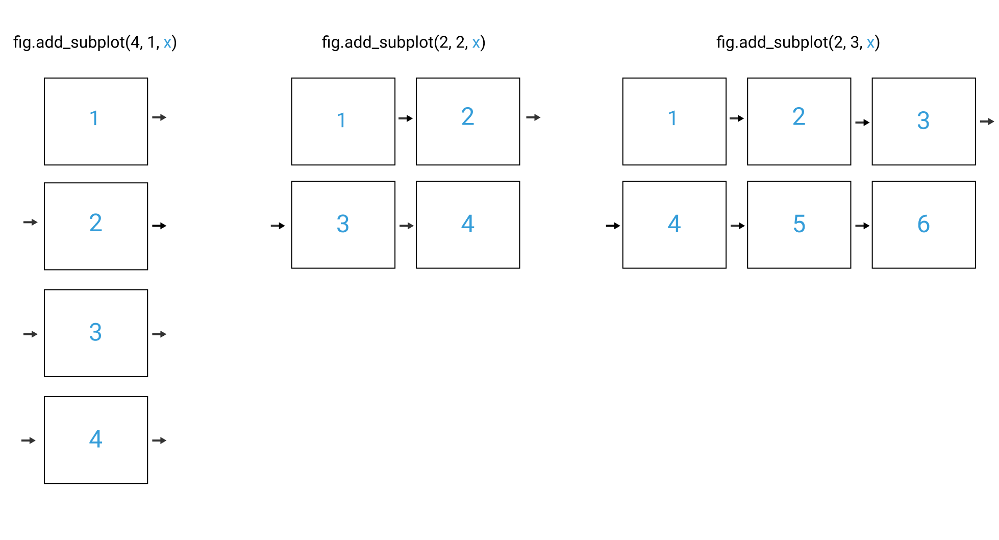
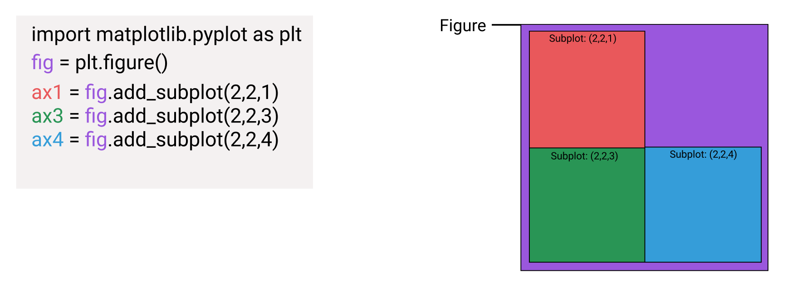

# learnDataAnalysis
This is the notebook for me to learn data science, especially for matplotlib.

# 1. Data Visualization
Before this section, I always use tables as a source of data. However, after thousands of years of evolution, I are more good at handling visual format data. In this section, I summaried some impotant tips about how to use pandas to visualize data.

### Introduction for matplotlib
I'll use `matplotlib` to create line chart, the general workflow is as follows:
<ul>
    <li>create a plot using data</li>
    <li>customize the appearance of the plot</li>
    <li>display the plot</li>
    <li>edit and repeat until satisfied
</li>
</ul>  
Matplotlib has pyplot module. Using the different pyplot functions, I can create, customize, and display a plot. For example, I can use 2 functions to :
```
import matplotlib.pyplot as plt
plt.plot()
plt.show()
```
Because I didn't pass in any arguments, the plot() function would generate an empty plot with just the axes and ticks and the show() function would display that plot.

You'll notice that I didn't assign the plot to a variable and then call a method on the variable to display it. I instead called 2 functions on the pyplot module directly.

This is because every time I call a pyplot function, the module maintains and updates the plot internally (also known as state). When I call show(), the plot is displayed and the internal state is destroyed. While this workflow isn't ideal when I're writing functions that create plots on a repeated basis as part of a larger application, it's useful when exploring data.

It's better to plot in jupyter notebook. You will need to run the following Jupyter magic in a code cell each time you open your notebook: %matplotlib inline. Whenever you call show(), the plots will be displayed in the output cell. 

### How to plot
To generate the line chart we're interested in, we pass in the list of x-values as the first parameter and the list of y-values as the second parameter to plot():
`plt.plot(x_values, y_values)`

### Rotate x and y labels
We can use pyplot.xticks(*args, **kwargs) to rotate x ticks and use pyplot.yticks(*args, **kwargs) to rotate y ticks directioin. How to set `*args` is described [here](*args). We can rotate the x axis ticks by 90 degree as follows:
```
import matplotlib.pyplot as plt
sub_data = unrate[0:12]
plt.plot(sub_data['DATE'], sub_data['VALUE'])
plt.xticks(rotation=90)
```

### Labels and title
Use xlabel(), ylabel() and title() of pyplot to add useful information to the chart

### Multiple plot
Here is an example:
```
import matplotlib.pyplot as plt
fig = plt.figure()
ax1 = fig.add_subplot(2,1,1)
ax2 = fig.add_subplot(2,1,2)
plt.show()
```
When the first subplot is created, matplotlib knows to create a grid with 2 rows and 2 columns. As we add each subplot, we specify the plot number we want returned and the corresponding Axes object is created and returned. In matplotlib, the plot number starts at the top left position in the grid (left-most plot on the top row), moves through the remaining positions in that row, then jumps to the left-most plot in the second row, and so forth.


If we created a grid of 4 subplots but don't create a subplot for each position in the grid, areas without axes are left blank:


```
import matplotlib.pyplot as plt
fig = plt.figure()
ax1 = fig.add_subplot(2,1,1)
ax2 = fig.add_subplot(2,1,2)
ax1.plot(unrate["DATE"][0:12], unrate["VALUE"][0:12])
ax2.plot(unrate["DATE"][12:24], unrate["VALUE"][12:24])
plt.show()
```

### Resizing
When drawing multiple plots, the figure size remain the same. This can make the plots squeeze together and hard to see.  To tweak the dimensions of the plotting area, we need to use the figsize parameter when we call plt.figure():
`fig = plt.figure(figsize=(width, height))`
The unit for both width and height values is inches. 

### 